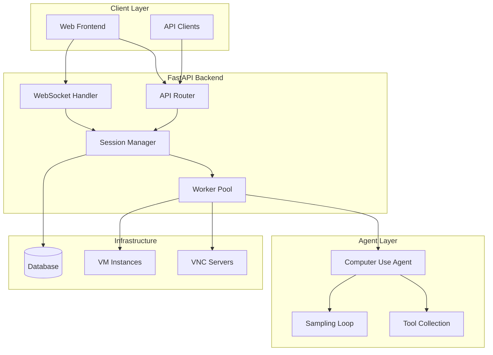

# Design Document

## Overview

The Computer Use Backend Rebuild transforms the existing Streamlit-based Anthropic Computer Use Demo into a scalable, production-ready FastAPI backend system. The new architecture preserves all existing agent functionality while introducing session management, real-time streaming, unlimited concurrency, database persistence, and a modern web interface.

The system maintains the core Computer Use Agent Loop from the original demo but wraps it in a robust backend infrastructure that supports multiple concurrent sessions, each with dedicated VM and Firefox instances. This design enables horizontal scaling and production deployment while preserving the experimental capabilities that make the original demo valuable.

## Architecture

### High-Level Architecture



### Component Architecture

The system follows a layered architecture with clear separation of concerns:

1. **API Layer**: FastAPI routers handling HTTP requests and WebSocket connections
2. **Session Management Layer**: Manages session lifecycle, worker allocation, and state persistence
3. **Worker Layer**: Independent processes executing agent loops for each session
4. **Agent Layer**: Preserved Computer Use Agent logic with tool execution
5. **Infrastructure Layer**: Database, VNC servers, and VM instances

### Concurrency Model

Each session operates in complete isolation:
- Dedicated worker process per session
- Independent VM instance with separate desktop environment
- Isolated Firefox browser instance
- Separate VNC server for desktop access
- Independent tool execution context

This design ensures unlimited scalability and prevents cross-session interference.

## Components and Interfaces

### FastAPI Application

**Core Application Structure:**
```python
class ComputerUseBackend:
    def __init__(self):
        self.session_manager = SessionManager()
        self.database = Database()
        self.worker_pool = WorkerPool()
```

**API Endpoints:**
- `POST /sessions` - Create new session
- `GET /sessions` - List all sessions  
- `GET /sessions/{id}/messages` - Retrieve message history
- `POST /sessions/{id}/messages` - Send message and spawn worker
- `WS /sessions/{id}/stream` - Real-time execution streaming
- `GET /sessions/{id}/vnc` - VNC proxy endpoint

### Session Manager

**Interface:**
```python
class SessionManager:
    async def create_session(self) -> Session
    async def get_session(self, session_id: str) -> Session
    async def list_sessions(self) -> List[Session]
    async def terminate_session(self, session_id: str) -> None
    async def get_worker(self, session_id: str) -> Worker
```

**Responsibilities:**
- Session lifecycle management
- Worker allocation and cleanup
- Resource tracking and monitoring
- Session state persistence

### Worker Pool

**Interface:**
```python
class WorkerPool:
    async def spawn_worker(self, session_id: str) -> Worker
    async def get_worker(self, session_id: str) -> Worker
    async def terminate_worker(self, session_id: str) -> None
    async def health_check(self) -> Dict[str, WorkerStatus]
```

**Worker Implementation:**
```python
class Worker:
    def __init__(self, session_id: str):
        self.session_id = session_id
        self.vm_instance = VMInstance()
        self.vnc_server = VNCServer()
        self.agent_loop = ComputerUseAgentLoop()
    
    async def process_message(self, message: str) -> AsyncIterator[AgentUpdate]
    async def get_vnc_stream(self) -> bytes
    async def cleanup(self) -> None
```

### Database Layer

**Schema Design:**
```sql
CREATE TABLE sessions (
    session_id UUID PRIMARY KEY,
    created_at TIMESTAMP DEFAULT NOW(),
    updated_at TIMESTAMP DEFAULT NOW(),
    status VARCHAR(20) DEFAULT 'active',
    metadata JSONB
);

CREATE TABLE messages (
    message_id UUID PRIMARY KEY,
    session_id UUID REFERENCES sessions(session_id),
    role VARCHAR(20) NOT NULL,
    content TEXT NOT NULL,
    timestamp TIMESTAMP DEFAULT NOW(),
    metadata JSONB
);
```

**Database Interface:**
```python
class Database:
    async def create_session(self, session: Session) -> None
    async def get_session(self, session_id: str) -> Session
    async def list_sessions(self) -> List[Session]
    async def save_message(self, message: Message) -> None
    async def get_messages(self, session_id: str) -> List[Message]
```

### WebSocket Streaming

**Stream Handler:**
```python
class StreamHandler:
    async def handle_connection(self, websocket: WebSocket, session_id: str)
    async def broadcast_update(self, session_id: str, update: AgentUpdate)
    async def handle_disconnect(self, session_id: str, websocket: WebSocket)
```

**Update Types:**
- Agent thinking updates
- Tool execution progress
- Screenshot captures
- Error notifications
- Completion status

## Data Models

### Core Models

```python
@dataclass
class Session:
    session_id: str
    created_at: datetime
    updated_at: datetime
    status: SessionStatus
    worker_id: Optional[str] = None
    vnc_port: Optional[int] = None

@dataclass
class Message:
    message_id: str
    session_id: str
    role: MessageRole
    content: str
    timestamp: datetime
    metadata: Dict[str, Any]

@dataclass
class AgentUpdate:
    update_type: UpdateType
    content: str
    timestamp: datetime
    metadata: Dict[str, Any]

class SessionStatus(Enum):
    ACTIVE = "active"
    PROCESSING = "processing"
    IDLE = "idle"
    TERMINATED = "terminated"

class MessageRole(Enum):
    USER = "user"
    ASSISTANT = "assistant"
    TOOL = "tool"

class UpdateType(Enum):
    THINKING = "thinking"
    TOOL_USE = "tool_use"
    TOOL_RESULT = "tool_result"
    SCREENSHOT = "screenshot"
    ERROR = "error"
    COMPLETE = "complete"
```

### Agent Integration Models

```python
@dataclass
class ComputerUseAgentConfig:
    model: str
    provider: APIProvider
    api_key: str
    tool_version: ToolVersion
    max_tokens: int
    system_prompt_suffix: str

@dataclass
class WorkerContext:
    session_id: str
    vm_instance: VMInstance
    vnc_server: VNCServer
    agent_config: ComputerUseAgentConfig
    tool_collection: ToolCollection
```

## Correctness Properties

*A property is a characteristic or behavior that should hold true across all valid executions of a system-essentially, a formal statement about what the system should do. Properties serve as the bridge between human-readable specifications and machine-verifiable correctness guarantees.*

<function_calls>
<invoke name="prework">
<parameter name="featureName">computer-use-backend

### Property Reflection

After reviewing all testable properties from the prework analysis, I identified several areas where properties can be consolidated to eliminate redundancy:

**Consolidation Opportunities:**
- Properties 2.2, 2.4, and 4.1 all relate to message processing and can be combined into a comprehensive message handling property
- Properties 3.1, 3.2, 3.3, and 3.5 all relate to WebSocket streaming and can be consolidated into streaming behavior properties
- Properties 5.1, 5.2, 5.3, and 5.5 all relate to VNC functionality and can be combined
- Properties 7.1, 7.2, 7.3, 7.4, and 7.5 all relate to agent compatibility and can be consolidated
- Properties 8.1, 8.2, 8.3, and 8.4 all relate to monitoring and can be combined

**Final Property Set:**
The following properties provide comprehensive coverage without redundancy:

Property 1: Concurrent session independence
*For any* number of sessions created simultaneously, each session should have independent workers, VM instances, and Firefox browsers without blocking each other
**Validates: Requirements 1.2, 1.3**

Property 2: Message processing and persistence
*For any* message sent to a session, the system should spawn a worker to process it, persist the message to the database immediately, and return complete message history in chronological order when queried
**Validates: Requirements 2.2, 2.4, 4.1, 4.2, 4.4**

Property 3: Error handling for invalid inputs
*For any* invalid session ID provided to API endpoints, the system should return appropriate HTTP error responses
**Validates: Requirements 2.5**

Property 4: WebSocket streaming behavior
*For any* WebSocket connection to a session stream, the system should provide real-time agent execution updates, broadcast to all connected clients, and send completion status when agent execution finishes
**Validates: Requirements 3.1, 3.2, 3.3, 3.5**

Property 5: Data persistence across restarts
*For any* session and message data stored in the database, the data should remain intact and accessible after system restarts
**Validates: Requirements 4.3**

Property 6: VNC functionality
*For any* session created, the system should provide VNC access to the session's desktop environment, relay desktop display data to clients, support concurrent VNC connections, and properly cleanup VNC resources when sessions are terminated
**Validates: Requirements 5.1, 5.2, 5.3, 5.5**

Property 7: Agent compatibility preservation
*For any* computer task executed through the new backend, the system should preserve all original Computer Use Agent functionality, reuse existing tool handlers, maintain identical execution patterns, support all original capabilities, and produce outputs consistent with the original demo
**Validates: Requirements 7.1, 7.2, 7.3, 7.4, 7.5**

Property 8: System monitoring and logging
*For any* system operation, error, active session, or concurrent operation, the system should log significant events with appropriate detail levels, capture error details for debugging, track resource usage and performance metrics, and provide visibility into worker status and execution state
**Validates: Requirements 8.1, 8.2, 8.3, 8.4**

## Error Handling

### Error Categories

**API Errors:**
- Invalid session IDs return 404 Not Found
- Malformed requests return 400 Bad Request  
- Authentication failures return 401 Unauthorized
- Rate limiting returns 429 Too Many Requests
- Server errors return 500 Internal Server Error

**Worker Errors:**
- Worker spawn failures trigger automatic retry with exponential backoff
- Agent execution errors are captured and streamed to clients
- Tool execution failures are handled gracefully with error responses
- Resource allocation failures trigger cleanup and error reporting

**Database Errors:**
- Connection failures trigger automatic reconnection
- Transaction failures are rolled back with error logging
- Data consistency errors trigger integrity checks
- Migration failures halt startup with detailed error messages

**Infrastructure Errors:**
- VM allocation failures trigger resource cleanup
- VNC server failures trigger restart attempts
- Network connectivity issues trigger reconnection logic
- Docker container failures trigger health checks and restarts

### Error Recovery Strategies

**Graceful Degradation:**
- Continue serving existing sessions when new session creation fails
- Maintain WebSocket connections during temporary database outages
- Preserve agent state during transient infrastructure failures
- Provide cached responses when possible during service disruptions

**Automatic Recovery:**
- Restart failed workers automatically with state restoration
- Reconnect to database with exponential backoff
- Recreate VNC servers for active sessions
- Restart Docker containers with health checks

## Testing Strategy

### Dual Testing Approach

The system requires both unit testing and property-based testing to ensure comprehensive coverage:

**Unit Testing:**
- API endpoint behavior verification
- Database operation correctness
- WebSocket connection handling
- Error condition responses
- Integration between components

**Property-Based Testing:**
- Universal properties across all valid inputs
- Concurrent behavior verification
- Data consistency guarantees
- Resource management correctness
- Agent compatibility preservation

### Property-Based Testing Implementation

**Testing Framework:** We will use Hypothesis for Python property-based testing, configured to run a minimum of 100 iterations per property test.

**Property Test Requirements:**
- Each property-based test must be tagged with a comment referencing the design document property
- Tag format: `**Feature: computer-use-backend, Property {number}: {property_text}**`
- Each correctness property must be implemented by exactly one property-based test
- Tests must generate realistic input data that exercises the full range of system behavior

**Test Data Generation:**
- Session IDs: Generate valid UUIDs and invalid formats
- Messages: Generate various content types, lengths, and formats
- Concurrent operations: Generate multiple simultaneous requests
- WebSocket connections: Generate connection/disconnection patterns
- Agent tasks: Generate diverse computer use scenarios

### Integration Testing

**End-to-End Scenarios:**
- Complete user workflows from session creation to task completion
- Multi-session concurrent execution
- WebSocket streaming during agent execution
- VNC access and desktop interaction
- Database persistence across system restarts

**Performance Testing:**
- Session creation throughput
- Message processing latency
- WebSocket streaming performance
- VNC streaming quality
- Resource utilization under load

### Testing Infrastructure

**Test Environment:**
- Dockerized test environment matching production
- Isolated database instances for test data
- Mock external services for controlled testing
- Automated test execution in CI/CD pipeline

**Test Data Management:**
- Fixtures for common test scenarios
- Database seeding for integration tests
- Cleanup procedures for test isolation
- Performance baseline measurements